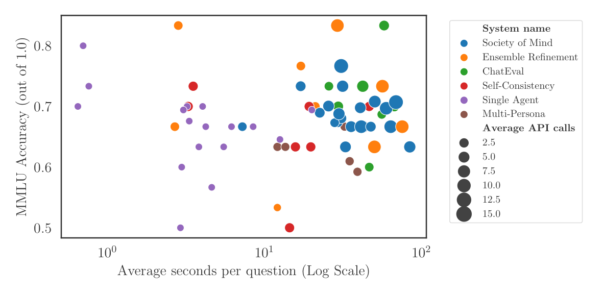

# 💬 DebateLLM - debating LLMs for truth discovery in medicine and beyond

## 👀 Overview

DebateLLM is a library that encompasses a variety of debating protocols and prompting strategies, aimed at enhancing the accuracy of Large Language Models (LLMs) in Q&A datasets.

Our research (mostly using GPT-3.5) reveals that no single debate or prompting strategy consistently outperforms others across all scenarios. Therefore it is important to experiment with various approaches to find what works best for each dataset. However, implementing each protocol can be time-consuming. We therefore built and open-sourced DebateLLM to facilitate its use by the research community. It enables researchers to test various implementations from the literature on their specific problems (medical or otherwise), potentially driving further advancements in the intelligent prompting of LLMs.

We have various system implementations:

<table align="center">
  <tr>
    <td align="center"></td>
    <td align="center"></td>
    <td align="center"></td>
  </tr>
  <tr>
    <td align="center"><a href="https://arxiv.org/abs/2305.14325">Society of Minds</a></td>
    <td align="center"><a href="https://arxiv.org/abs/2311.16452">Medprompt</a></td>
    <td align="center"><a href="https://arxiv.org/abs/2307.05300">Multi-Persona</a></td>
  </tr>
</table>

<table align="center">
  <tr>
    <td align="center"></td>
    <td align="center"></td>
    <td align="center"></td>
  </tr>
  <tr>
    <td align="center"><a href="https://arxiv.org/abs/2305.09617">Ensemble Refinement</a></td>
    <td align="center"><a href="https://arxiv.org/abs/2308.07201">ChatEval</a></td>
    <td align="center"><a href="https://arxiv.org/abs/2307.05300">Solo Performance Prompting</a></td>
  </tr>
</table>


## 🔧 Installation

To set up the DebateLLM environment, execute the following command:

```bash
make build_venv
```

## 🚀 Running an Experiment

To run an experiment:

1. Activate the Python virtual environment:
    ```bash
    source venv/bin/activate
    ```
2. Execute the evaluation script:
    ```bash
    python ./experiments/evaluate.py
    ```

    You can modify experiment parameters by using Hydra configs located in the `conf` folder. The main configuration file is found under `conf/config.yaml`. Changes at the database and system levels can be made by updating the configs in `conf/dataset` and `conf/system`.

To launch multiple experiments:
```bash
python ./scripts/launch_experiments.py
```

## 📊 Visualising Results
To visualize the results with Neptune:
1. Run the visualisation script:
    ```bash
    python ./scripts/visualise_results.py
    ```
2. The output results will be saved to ./data/charts/.

## 📊 Benchmarks

Our benchmarks showcase DebateLLM's performance on MedQA, PubMedQA, and MMLU datasets, focusing on accuracy versus cost, time efficiency, token economy, and agent agreement impact. These visualizations illustrate the balance between accuracy and computational cost, the speed and quality of responses, linguistic efficiency, and the effects of consensus strategies in medical Q&A contexts. Each dataset highlights the varied capabilities of DebateLLM's strategies.

### MedQA Dataset

<div>
  
  
</div>
<div>
  
  
</div>

### PubMedQA Dataset

<div>
  
  
</div>
<div>
  
  
</div>

### MMLU Dataset

<div>
  
  
</div>
<div>
  
  
</div>

### Agent Agreement Analysis

Modulating the agreement intensity provides a substantial improvement in performance for various models. For Multi-Persona, there is an approximate 15% improvement, and for Society of Minds (SoM), an approximate 5% improvement on the USMLE dataset. The 90% agreement intensity prompts applied to Multi-Persona demonstrate a new high score on the MedQA dataset, highlighted in the MedQA dataset cost plot as a red cross.

<div>
  
  
</div>

The benchmarks indicate the effectiveness of various strategies and models implemented within DebateLLM. For detailed analysis and discussion, refer to our [paper](https://arxiv.org/abs/2311.17371).

## Contributing 🤝
Please read our [contributing docs](docs/CONTRIBUTING.md) for details on how to submit pull requests, our Contributor License Agreement and community guidelines.


## 📚 Citing DebateLLM

If you use DebateLLM in your work, please cite our paper:
```bibtex
@article{anon,
  title={Should we be going MAD? A Look at Multi-Agent Debate Strategies for LLMs},
  author={Anon},
  year={2024},
}

```
Link to the paper: Anon.
